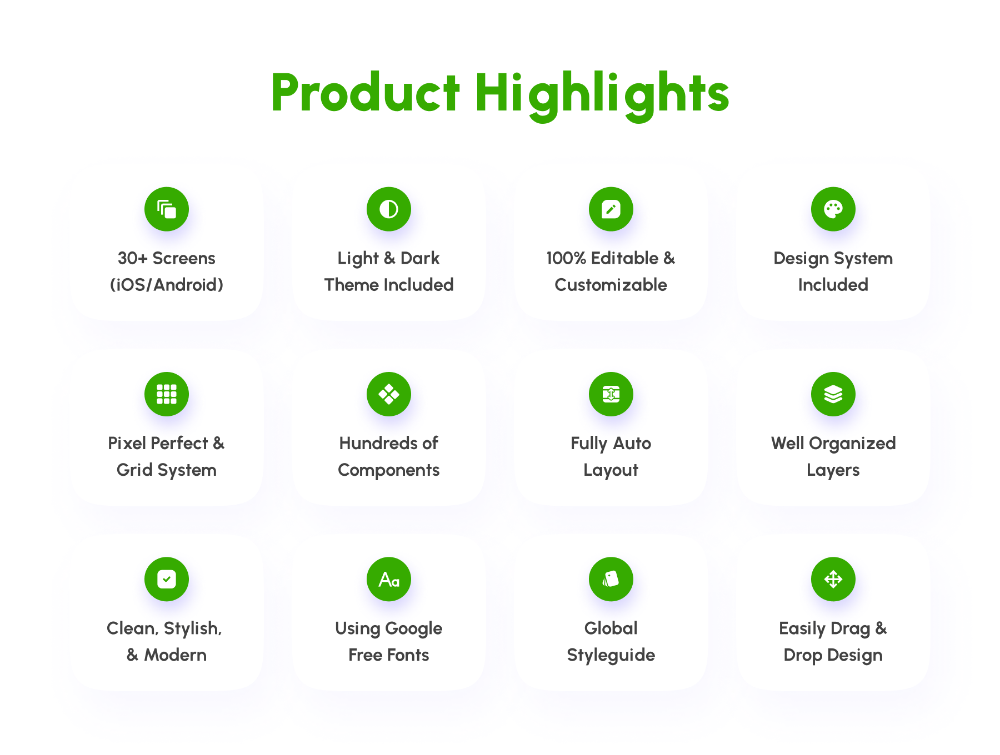
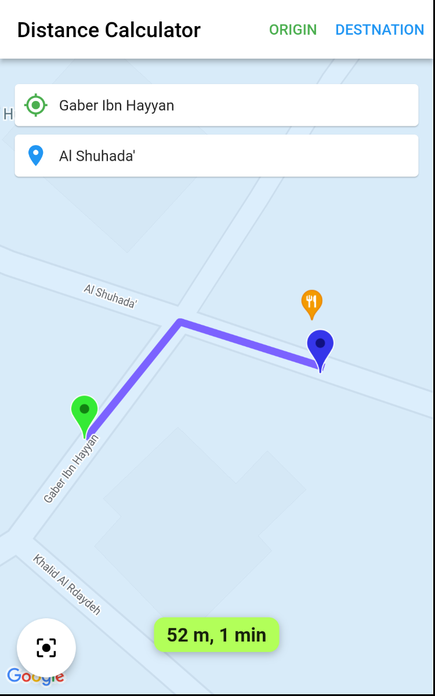

# Portfolio

# Pet Care

# APK

 

# Trus Home

  

# Shopper

  

# APK

 

# Dawak (Sahtak)

[comment]: <> (
)

# APK

 

# Receptions

[comment]: <> (
)

[comment]: <> ()

[comment]: <> (  
)

# APK

 

# Cryptok

# APK

  

 

  

   

   

# APK

 

# Tabibko

[comment]: <> (
)

# APK

 

# MAPPER

  

   

   
   
   

# APK

 

# Notey

[comment]: <> (
)

[comment]: <> ()

[comment]: <> (  
)

# APK

 

# Quran (ISLAM SUBHI)

[comment]: <> (
)

# APK

 

# Memory Game 

[comment]: <> (
)

[comment]: <> (
)

[comment]: <> (  )

[comment]: <> (   )

[comment]: <> (   )

[comment]: <> (
)

